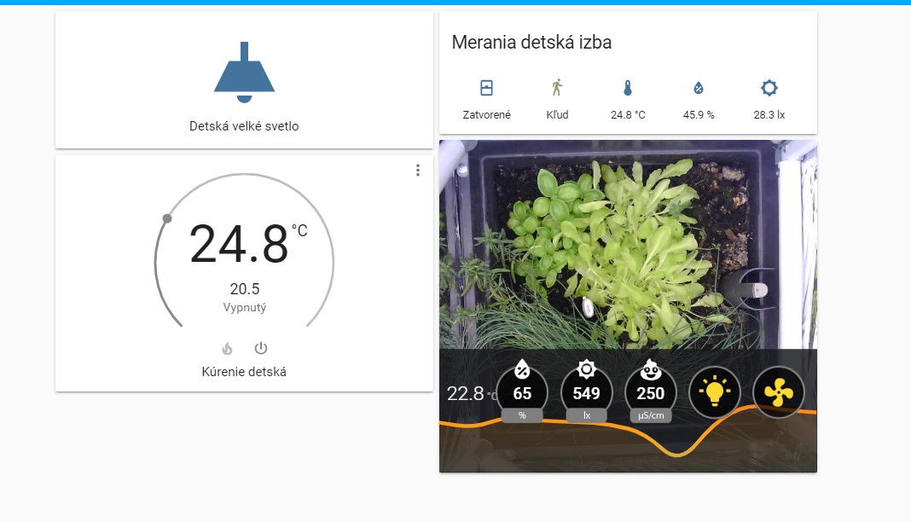

## Idea behind this project

Simple but functional indoor greenhouse, with intergalactic space design and smart capabilities, powered by ESPHome and HomeAssistant.

We had one big pot with herbs in our kitchen, but in winter, there is not enough light to grow them at reasonable rate. So I came with idea to build some cover around it, and of course to make it smart, because who would remember to water it anyaway right ? 

## Design and build

I sketched whole thing in Fusion360 and started to print the parts. 

The frame is made from 3D printed cornes, and tubes for electrical installations with inner diameter of 22mm , you can get them in 3 meter lengths pretty cheap. 

Whole frame is screwed together with corner parts, and as wall material I used 2 layers of isotermic foil which you can find in car firs-aid kit or in pharmacy for like 2 €. Foil is attached with  aluminium tape used for insulation of water pipes. 

You could probably use any dimensions of pot, and adjust it by cutting different lengths of pipes. I luckily chosen just right dimension so on the top there fits just right some lid from IKEA, so I dind't have to think about what material I could use.

Pot itself is self-watering, it has reservoir at the bottom and it is draining the water through some wicks under the soil. For now , I don't need to solve watering by some pump, but this could be fairly easy to implement by another transistor connected to ESP32, controlling the water-pump. We will see how it will go in the hotter months. 

## Electronics

At the top there are 3 LED light bars, as you can see I just improvised and attached another red-blue grow lights, as well as IR and UV leds, by just zipties. I was searching for decent grow lights but It costs quite enough for this proof of concept, but I noticed there are also IR and UV leds in some ratio. So I ordered spare IR blaster for CCTV camera, and shortest possible strip of UV leds. They are controlled by NPN transistor, driven from ESP32-CAM board. The same applies to the fan at the TOP. 

I didn't sketched PCB for this project, all is installed on 30 x 50 protoboard. 

### Sensors
There is Xiaomi MiFlora sensor in the soil, I wanted to ESP32 act as Bluetooth gateway, because with aluminium foil all around you basically create faradays cage, so there is quite problem to get the signal out of it, But soon I realised that I wanted too much from ESP32 board, to handle the camera stream, control 2 channels of PWM for LEDS and fan, and to track BLE devices. I will solve this by reading the datas from MiFlora by another device. 

I wanted to have camera at the top, so I could take photos and make some time-lapse of growing. 

Power consumption of whole system is measured by INA219 board, it communicates through I2C, and it's simple to use. I calculate the price for our country, you'll have to edit this in sketch. 

## Data view
I also designed lovelace card for showing all informations about greenhouse. 

You should have card-mod addon for lovelace installed, as I am using it to change css style of card. There is folder Lovelace-card-resources with files you should copy to your www folder, as I am using it in card.

Lovelace config is in lovelace-card.yaml file.

## TimeLapse videos
I am making snapshots through HomeAssistant automation saving all files in local www folder, and then massage  these photos through NodeRed, which outputs gif files, and I am showing these gif files as local_file camera. All neccessary config files are included. 

All files can be find [on my thingiverse.com/Luc3as](https://www.thingiverse.com/thing:4233190)

### If You liked my work, You can buy me a coffee :)

### Or send some crypto

	
				    			    			    							    			     			    	